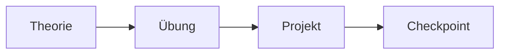

---
hide:
  - navigation
  - toc
---

# AE Raumklima Bootcamp

Willkommen zum IT-Bootcamp! In dieser Woche baust du deine erste eigene Web-App.

## Was wird gebaut?

Ein **Raumklima-Monitor** für Lernräume. Die App zeigt Temperatur, Luftfeuchtigkeit, Raumname und Status auf einen Blick.

- :material-thermometer: **Temperatur** – aktuelle Gradzahlen im Raum
- :material-water-percent: **Luftfeuchtigkeit** – aktuelle Prozentwerte
- :material-home: **Raumname** – welcher Raum wird überwacht?
- :material-check-circle: **Status** – ist die Luft gut, kritisch oder schlecht?
- :material-history: **Verlauf** – wie hat sich das Klima verändert?

## Ziel der Woche

Am Ende der Woche hast du:

- [ ] Eine funktionierende Web-App gebaut
- [ ] HTML, CSS und JavaScript gelernt
- [ ] Daten aus einem JSON-File oder einer API geladen
- [ ] Eine Demo deiner App vorbereitet und vorgestellt
- [ ] Im Team zusammengearbeitet

## Keine Vorkenntnisse?

Kein Problem! Das Bootcamp startet bei null. Alles wird Schritt für Schritt erklärt.

## Ablaufmodell

Jeder Tag folgt dem gleichen Rhythmus:

| Phase | Dauer | Was passiert? |
|-------|-------|---------------|
| :material-book-open-outline: Theorie | ~1 Std. | Neues Wissen als Input |
| :material-pencil-outline: Übung | ~1 Std. | Geführte Aufgabe zum Ausprobieren |
| :material-hammer-wrench: Projekt | ~2–3 Std. | Am eigenen Projekt arbeiten |
| :material-clipboard-check-outline: Checkpoint | ~45 Min. | Tagesabschluss, Rückblick, Fragen |

## Wochenübersicht

| Tag | Datum | Fokus |
|-----|-------|-------|
| Tag 1 | 06.08. | Einstieg, Web-App Basics, erste Oberfläche |
| Tag 2 | 07.08. | JSON, API, Fetch, Statuslogik, Verlauf |
| Tag 3 | 10.08. | Retro, Schnittstellen, Integration, Demo-Vorbereitung |
| Tag 4 | 11.08. | Finish, Testen, optionale Features, Demo finalisieren |
| Tag 5 | 12.08. | Präsentation & Abschluss |

## Los geht's

Starte mit [Tag 1](tag-1/index.md) oder lies zuerst die [Projektübersicht](projekt/ueberblick.md).
