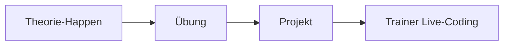

---
hide:
  - navigation
  - toc
---

# AE Raumklima Bootcamp

Willkommen zum IT-Bootcamp! In dieser Woche baust du deine erste eigene Web-App.

## Was wird gebaut?

Ein **Raumklima-Monitor** für Lernräume. Die App zeigt Temperatur, Luftfeuchtigkeit, Raumname und Status auf einen Blick.

- :material-thermometer: **Temperatur** – aktuelle Gradzahlen im Raum
- :material-water-percent: **Luftfeuchtigkeit** – aktuelle Prozentwerte
- :material-home: **Raumname** – welcher Raum wird überwacht?
- :material-check-circle: **Status** – ist die Luft gut, kritisch oder schlecht?
- :material-history: **Verlauf** – wie hat sich das Klima verändert?

## Ziel der Woche

Am Ende der Woche hast du:

- [ ] Eine funktionierende Web-App gebaut
- [ ] HTML, CSS und JavaScript gelernt
- [ ] Daten aus einem JSON-File oder einer API geladen
- [ ] Eine Demo deiner App vorbereitet und vorgestellt
- [ ] Selbststaendig an einer eigenen App gearbeitet

## Keine Vorkenntnisse?

Kein Problem! Das Bootcamp startet bei null. Alles wird Schritt für Schritt erklärt.

## Ablaufmodell

Jeder Tag (Tag 1–3) folgt dem gleichen Rhythmus:

```mermaid
graph LR
    A[Theorie-Happen] --> B[Übung]
    B --> C[Projekt]
    C --> D[Trainer Live-Coding]
```

| Phase | Dauer | Was passiert? |
|-------|-------|---------------|
| :material-book-open-outline: Theorie-Happen | ~2 Std. | 5–6 kurze Happen à ~10 min, dazwischen Live-Coding |
| :material-pencil-outline: Übung | ~2 Std. | WOW-Effekt: leeres Repo, Schritt für Schritt mit Lücken |
| :material-hammer-wrench: Projekt | ~2–3 Std. | Am eigenen Hauptprojekt arbeiten (`app/`) |
| :material-code-braces: Trainer Live-Coding | ~1 Std. | Trainer zeigt die exakte Projekt-Lösung des Tages |

Tag 4: **freies Austoben** (Polish + optionale Features). Tag 5: **nur Demo**.

## Wochenübersicht

| Tag | Fokus |
|-----|-------|
| Tag 1 | Einstieg, Web-App Basics, erste Oberfläche |
| Tag 2 | JSON, API, Fetch, Statuslogik, Verlauf |
| Tag 3 | API-Anbindung mit vereinfachtem Fallback, Layout final |
| Tag 4 | Polish + optionale Features (Dark Mode, Chart.js, Auto-Refresh, …) |
| Tag 5 | Demo & Abschluss |

> **Hinweis**: Diese Übersicht verwendet bewusst **keine konkreten
> Datumsangaben**. Die aktuelle Woche gilt, der genaue Tag wird
> im Kurs bekannt gegeben.

## Los geht's

Starte mit [Tag 1](tag-1/index.md) oder lies zuerst das
[Curriculum V2](curriculum-v2.md) für den Gesamtüberblick.
