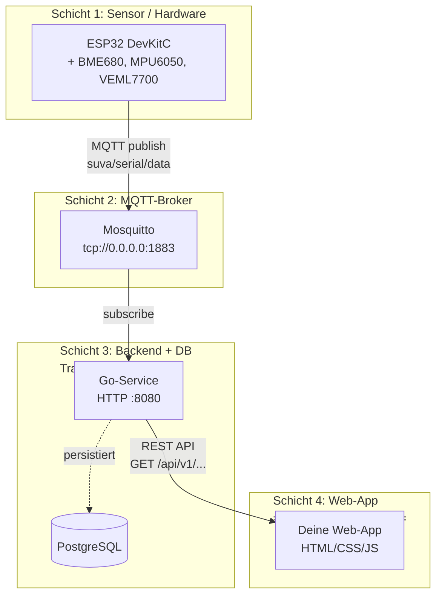
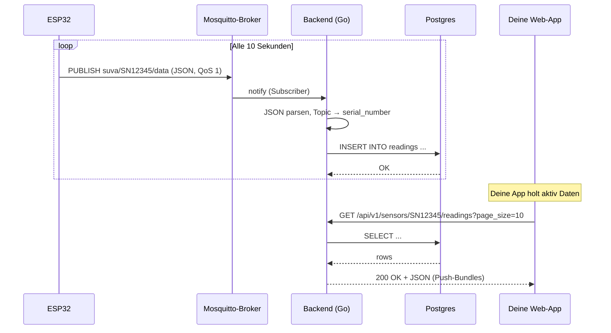
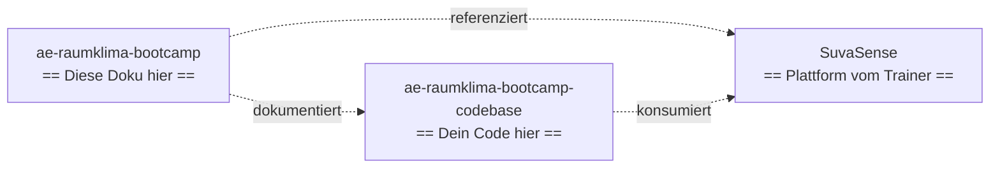

# Architektur

Das Bootcamp-Projekt besteht aus vier klar getrennten Schichten, die unabhängig voneinander gebaut und gewartet werden. Verbindendes Element ist die **SuvaSense-Plattform** im gleichnamigen Repo.

## 4 Schichten aus AE-Sicht



**Die 4 Schichten aus AE-Sicht:**

- **Schicht 1 + 2 + 3** baust du **nicht** – die sind vorgegeben
- **Schicht 4** ist deine Aufgabe: die Web-App, die die REST-API konsumiert

## Datenfluss: vom Sensor zu deiner App



**Drei wichtige Eigenschaften:**

1. **Push vom Sensor zum Server:** deine App sieht das nie direkt.
   Sensoren publishen, Backend speichert.
2. **Pull von deiner App:** du machst `GET /api/v1/sensors/...`
   wenn du Daten brauchst (z. B. bei Page-Load oder Auto-Refresh).
3. **Asynchron:** Sensor und App sind **entkoppelt**. Sensor
   pusht, wann er will; App pullt, wann sie will.

## Verantwortlichkeiten

| Schicht          | Wer                  | Liefert |
|------------------|----------------------|---------|
| Sensor (Firmware)| Plattformentwickler  | Funktionierende ESP32-Firmware, MQTT-Publish auf `suva/<serial>/data` |
| Broker           | Trainerteam          | Stabiler Mosquitto (anonym, Port 1883), im Stack dockerisiert |
| Backend          | Trainerteam          | Persistenz in Postgres + REST-API für die Lernenden-App |
| App              | Lernende             | Web-Frontend, das die REST-API konsumiert |

## Warum diese Trennung?

- **Plattformentwickler** müssen sich nicht mit Web-Apps auskennen
- **Lernende** müssen sich nicht mit Sensoren und MQTT auseinandersetzen
- **SuvaSense-Backend** ist die einzige Schnittstelle – der Vertrag steht in [API-Vertrag](api-vertrag.md)
- Jede Schicht kann unabhängig ersetzt werden, solange Topic- und JSON-Schema eingehalten werden

## Drei Repositories



| Repo                                     | Inhalt                                         | Wer arbeitet hier               |
|------------------------------------------|------------------------------------------------|---------------------------------|
| `ae-raumklima-bootcamp`                  | Dieser Lernleitfaden (MkDocs)                  | Trainer (Doku)                  |
| `ae-raumklima-bootcamp-codebase`         | Lernenden-Code (`app/`)                        | Lernende                        |
| `SuvaSense`                              | Backend, Broker, Firmware, Hardware            | Trainer (Plattform)             |

## SuvaSense-Stack

Das Backend wird vom Trainerteam zentral betrieben (eigener Laptop oder
Schulungs-Server). Vier Services starten mit einem einzigen Befehl:

```bash
cd SuvaSense
cp Backend/.env.example Backend/.env
docker compose up -d --build
```

Dann läuft:

| Service     | Port (Host) | Zweck                                  |
|-------------|-------------|----------------------------------------|
| backend     | 8080        | REST-API für die Lernenden-App         |
| mosquitto   | 1883, 9001  | MQTT-Broker für ESP32-Publishes        |
| postgres    | 5432        | Persistenz (Sensoren + Messwerte)      |
| pgadmin     | 5050        | Web-UI für die Postgres-DB (Inspektion)|

Lernende bekommen nur die REST-URL und ggf. die Demo-Seriennummer.
Den Stack startet und überwacht der Trainer.

## Verbindung SuvaSense ↔ Lernenden-Workspace

- **API-URL**: vom Trainer zu Tag 3 mitgeteilt (typisch `http://192.168.1.42:8080/api/v1`)
- **Demo-Seriennummer**: vom Trainer zu Tag 3 mitgeteilt (typisch `SN12345` oder `DEMO-001`)
- **Codebase-Repo `mock-api/`**: bleibt als pädagogisches Beispiel im Repo, ist aber **nicht** Bootcamp-Wahrheit. Das SuvaSense-Backend ist die einzige Quelle.

## Verwandte Seiten

- [API-Vertrag](api-vertrag.md) – die REST-API im Detail
- [MQTT-Ingest-Vertrag](ingest-vertrag.md) – der Topic- und
  Payload-Vertrag (Schwester zum API-Vertrag)
- [Schnittstellen klären](../tag-2/schnittstellen.md) – wie der
  Datenvertrag mit den PE-Teams entsteht