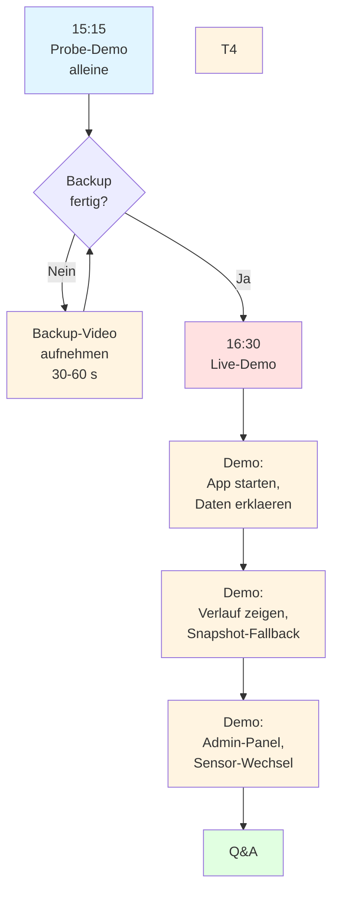

# Demo-Checkliste

## Ziel der Demo

Du zeigst am Ende der Woche deine App vor allen anderen Lernenden und Trainern.

- Dauer: ca. 5 Minuten pro Person
- Format: Live-Demo der App + kurze Erklärung
- Du zeigst deinen eigenen Ablauf

## Demo-Ablauf auf einen Blick



**Was passiert in welcher Phase:**

| Zeit | Phase | Wer | Inhalt |
|---|---|---|---|
| 15:15 | Probe-Demo | Du | Backup-Video aufnehmen |
| 16:30 | Live-Demo startet | Du | Backup-Video bereit, Ruhe |
| 16:30–16:31 | Begruessung | Du | "Ich zeige meine App ..." |
| 16:31–16:35 | App + Live-Daten | Du | App im Browser, Dashboard zeigen |
| 16:35–16:38 | Verlauf + Snapshot | Du | 10 letzte Messungen, dann WLAN kurz trennen, Snapshot zeigt sich |
| 16:38–16:40 | Admin-Panel | Du | Sensor-Wechsel demonstrieren |
| 16:40–16:45 | Q&A | Du | Fragen beantworten |

**Total: ~5 Min pro Person.** Nicht überziehen, das Publikum wird unruhig.

## Checkliste für die Demo

### Vorbereitung

- [ ] App läuft lokal und zeigt Live-Daten vom SuvaSense-Backend
- [ ] Snapshot-Fallback funktioniert (Browser-Cache leeren, neu laden, prüfen ob Initial-Seed greift)
- [ ] Alle Pflicht-Features sind umgesetzt
- [ ] Es gibt keine offensichtlichen Bugs
- [ ] Die App wurde mit verschiedenen Werten getestet (gut, kritisch, schlecht)
- [ ] Der Browser ist im Vollbild-Modus
- [ ] Die Schrift ist gross genug für den Beamer
- [ ] Ich weiss, was ich in welcher Reihenfolge zeige
- [ ] **Trainer hat den SuvaSense-Stack laufen** (oder ihr habt Backup-Daten im `localStorage`)

### Ablauf der Demo

1. **Einleitung (1 Min.)**
    - Wer bin ich?
    - Was zeigt meine App?
    - Welche Sensoren sind im Schulungsraum verteilt? (Seriennummern)

2. **Live-Demo (3–5 Min.)**
    - Dashboard zeigen
    - Sensor-Auswahl erklären (welche Seriennummer zeigt was)
    - Status erklären (Farben)
    - Verlauf zeigen (Push-Bundle-Datenstruktur)
    - Snapshot-Fallback demonstrieren (WLAN kurz aus, App bleibt funktional)
    - Admin-Seite zeigen (falls vorhanden)
    - Optionales Feature zeigen (falls vorhanden, z. B. Lux aus VEML7700)

3. **Herausforderungen & Learnings (1–2 Min.)**
    - Was war schwierig? (z. B. push-bundle-Struktur vs. einfaches Array)
    - Was haben wir gelernt? (z. B. async/await, try/catch)
    - Was würden wir nächstes Mal anders machen?

### Demo-Skript (Vorlage)

```markdown
## Demo-Skript

### Einstieg
- Seite öffnen
- Sensor-Auswahl oder Raum kurz erklären
- Temperatur und Luftfeuchtigkeit zeigen
- Auf Status-Farbe hinweisen (gut / kritisch / schlecht)

### Verlauf & Logik
- Verlauf einblenden
- Erklären, wie sich der Status aus temp_c / hum_pct berechnet
- Zeigen, was bei kritischen Werten passiert

### Live-Integration & Snapshot
- WLAN kurz trennen → App fällt automatisch auf localStorage-Snapshot zurück
- Wieder verbinden → Live-Daten sind zurück
- Optional: Bonus-Feature zeigen
```

## Tipps für die Präsentation

!!! tip "Do's"
    - Vorher mindestens einmal durchlaufen
    - Langsam und deutlich sprechen
    - Blickkontakt zum Publikum
    - Bei Fehlern: ruhig bleiben, weitermachen
    - Ruhig und in deinem eigenen Tempo erklären

!!! warning "Don'ts"
    - Nicht den Code vorlesen
    - Nicht nur auf den Bildschirm schauen
    - Nicht zu schnell klicken
    - Keine Entschuldigungen («ist noch nicht fertig…»)
    - Nicht hektisch durch die Demo springen

## Bewertung (falls zutreffend)

- Funktioniert die App? (Pflichtumfang inkl. Live-Integration oder Fallback)
- Ist die App verständlich?
- Wurden eigene Ideen umgesetzt?
- Ist die Lösung nachvollziehbar erklärt?
- Präsentation klar und strukturiert?
