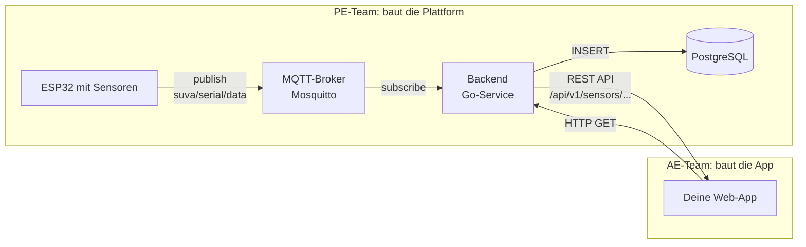

# Projektübersicht

## Raumklima-Monitor

Du baust eine Web-App, die das Raumklima in Lernräumen überwacht. Die
App greift live auf reale Sensoren zu, die im Schulungsraum verteilt
sind, und zeigt deren **Temperatur** und **Luftfeuchtigkeit** an.
Weitere Sensortypen (Licht, Bewegung, Gas-Widerstand) sind optional und
können in der App als Bonus angezeigt werden.

### Wie die Daten zu deiner App kommen



**Was du als AE-Lernender baust:** die Web-App rechts (das grosse
Rechteck "Deine Web-App"). Die Plattform links ist vom
PE-Team vorgegeben – du **konsumierst** sie nur über die
REST-API.

### Was die App können muss (Pflichtumfang)

- [ ] Dashboard mit Seriennummer (oder Raumname), Temperatur, Luftfeuchtigkeit
- [ ] Status-Anzeige: gut / kritisch / schlecht (Schwellenwerte werden **von EDB vorgegeben**, nicht selbst gewählt – siehe [EDB-Schwellenwerte](edb.md))
- [ ] Daten vom **SuvaSense-Backend** laden
- [ ] Snapshot-Fallback aus `localStorage`, wenn das Backend nicht erreichbar ist
- [ ] Fehlerfall anzeigen (z. B. «Keine Daten verfügbar»)
- [ ] Verlauf der letzten Messungen anzeigen (Push-Bundle-Modus)
- [ ] Einfache Admin-Seite für Sensor-Auswahl oder Grenzwerte
- [ ] Demo vorbereiten und präsentieren

### Was die App zusätzlich können kann (optional)

- [ ] Weitere Sensortypen anzeigen (`veml7700.lux`, `system.cpu_temp_c`, …)
- [ ] Diagramm / Chart für Temperatur- und Feuchtigkeitsverlauf
- [ ] Auto-Refresh der Daten
- [ ] Dark Mode
- [ ] Snapshot in LocalStorage persistieren
- [ ] Benachrichtigungs-Banner bei kritischen Werten
- [ ] Schönere UI (Animationen, Icons, Farben)
- [ ] Präsentationsmodus (grosse Schrift, Vollbild)

## Technische Basis

Die App besteht aus drei Dateien:

| Datei | Zweck |
|-------|-------|
| `index.html` | Struktur der Seite |
| `style.css` | Aussehen und Layout |
| `script.js` | Logik und Daten |

Keine Frameworks, kein Build-Tool – reines HTML, CSS und JavaScript.

## Statuslogik

Die genauen Schwellwerte werden im Projektlauf evaluiert. Ein sinnvoller Startwert ist:

| Status | Bedingung |
|--------|-----------|
| :material-check-circle: Gut | Temperatur 20–24 °C **und** Luftfeuchtigkeit 40–60 % |
| :material-alert: Mittel | Temperatur 18–26 °C **oder** Luftfeuchtigkeit 30–70 % |
| :material-close-circle: Kritisch | Alles ausserhalb |

Diese Logik bleibt 1:1 wie bisher; die Eingabewerte kommen neu aus
`readings.bme680.temp_c` und `readings.bme680.hum_pct`.

## Datenquelle

Die App lädt ihre Daten vom **SuvaSense-Backend** unter
`http://<vom-trainer-bekanntgegeben>:8080/api/v1`. Die
konkrete URL und die Demo-Seriennummer werden am Tag 3 vom Trainer
bekanntgegeben. Vollständiger Vertrag: [API-Vertrag](api-vertrag.md),
Architektur-Überblick: [Architektur](architektur.md).

```jsonc
// Antwort von GET /api/v1/sensors/SN12345/readings?page=1&page_size=10
{
  "serial_number": "SN12345",
  "mode": "push-bundles",
  "items": [
    {
      "recorded_at": "2026-08-06T10:30:00Z",
      "readings": {
        "bme680": { "temp_c": 23.4, "hum_pct": 51 }
      }
    }
    /* … weitere Push-Bundles, neueste zuerst … */
  ]
}
```

Im Bootcamp sind die **BME680-Werte** (`temp_c`, `hum_pct`) garantiert.
Andere Sensortypen können vorhanden sein oder nicht – die App behandelt
sie als optional.

!!! info "Snapshot-Fallback"
    Beim ersten erfolgreichen API-Aufruf speichert die App das
    aktuelle Daten-Array in `localStorage`. Wenn das Backend später
    nicht erreichbar ist, fällt die App automatisch auf diesen
    Snapshot zurück. So funktioniert die Demo auch bei WLAN-Ausfall.

## Datenmodell (App-Seite)

Jede Messung, die die App anzeigt, hat diese Felder:

```jsonc
{
  "recorded_at": "2026-08-06T10:30:00Z",   // Zeitpunkt
  "readings": {
    "bme680": { "temp_c": 23.4, "hum_pct": 51 }
    // weitere Typen möglich, aber nicht garantiert
  }
}
```

Optional können weitere Sensortypen vorhanden sein (`veml7700`, `mpu6050`, `system`). Die App behandelt sie als Bonus und zeigt sie nur an, wenn sie vorhanden sind.

## Meilensteine

| Tag | Meilenstein |
|-----|-------------|
| Tag 1 | Dashboard-Grundlayout steht, ein Sensor wird statisch angezeigt |
| Tag 2 | Daten werden geladen, Statuslogik funktioniert, Verlauf sichtbar |
| Tag 3 | Snapshot-Fallback implementiert, Layout finalisiert, Live-Integration mit SuvaSense |
| Tag 4 | Pflichtumfang komplett, getestet, Demo vorbereitet |
| Tag 5 | Präsentation & Abschluss |