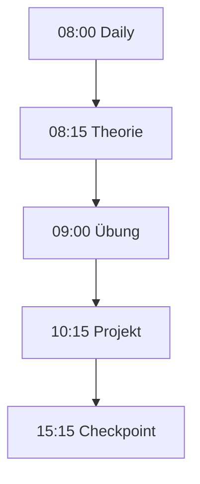

# Arbeitsweise

## Das Bootcamp-Modell

Jeder Tag folgt einem klaren Rhythmus:

## Tagesablauf im Detail

### :material-weather-sunny: Daily (08:00–08:15)

Kurzes Stand-up-Meeting im Team:

- Was habe ich gestern geschafft?
- Was nehme ich mir heute vor?
- Wo brauche ich Hilfe?

### :material-book-open-outline: Theorie (08:15–09:00)

Der Trainer gibt einen Input zum heutigen Thema.  
Fragen sind jederzeit willkommen!

### :material-pencil-outline: Übung (09:00–10:00)

Eine geführte Aufgabe. Du probierst das neue Wissen direkt aus.  
Die Übung ist nicht Teil deiner Projekt-App – sie dient zum Lernen.

### :material-hammer-wrench: Projekt (10:15–15:00)

Arbeit an deiner eigenen Web-App.  
Du setzt um, was im [Backlog](../projekt/backlog.md) steht.  
Mittagspause ca. 12:00–13:00.

### :material-clipboard-check-outline: Checkpoint (15:15–16:00)

Tagesabschluss:

- Was habe ich heute gelernt?
- Was habe ich gebaut?
- Was ist noch offen?
- Demo des aktuellen Stands

## Zusammenarbeit im Team

| Regel | Warum? |
|-------|--------|
| Immer zu zweit am Code | Zwei sehen mehr als einer |
| Täglich committen | Kein Code geht verloren |
| Bei Fragen: erst Team, dann Trainer | Fördert das gemeinsame Lernen |
| Pausen machen | Frischer Kopf = bessere Ideen |

## Definition of Done

Eine Aufgabe gilt als erledigt, wenn:

- [ ] Der Code ist geschrieben
- [ ] Der Code ist im Git-Repository
- [ ] Die Funktion ist getestet (manuell)
- [ ] Das Team hat den Code gesehen
- [ ] Es gibt keine bekannten Fehler

Mehr dazu: [Definition of Done](../projekt/definition-of-done.md)

!!! success "Das Wichtigste"
    Es geht nicht um Perfektion. Es geht darum, dass du am Ende der Woche  
    eine funktionierende App hast und weisst, wie du sie gebaut hast.
