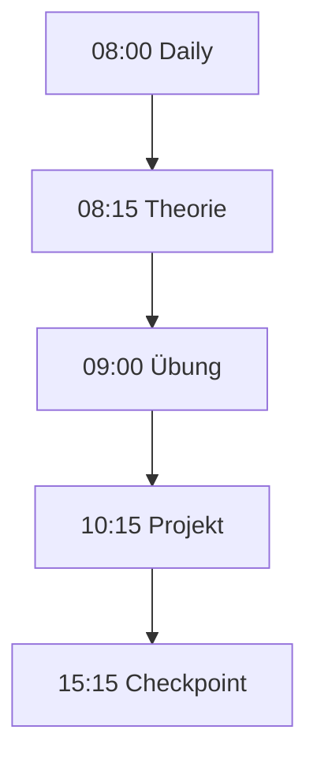

# Arbeitsweise

## Das Bootcamp-Modell

Jeder Tag folgt einem klaren Rhythmus:

```mermaid
graph TD
    D[08:00 Daily] --> T[08:15 Theorie]
    T --> U[09:00 Übung]
    U --> P[10:15 Projekt]
    P --> C[15:15 Checkpoint]
```

## :material-account: Du arbeitest allein

!!! info "Wichtigste Änderung zu früheren Bootcamps"
    Du arbeitest **alleine** an deinem Dashboard. Jeder hat sein
    eigenes Fork des Codebase-Repos. Es gibt keine Teams, keine
    Pair-Programming-Sessions im Lernmaterial.

    **Was sich nicht ändert:** Die **Joint-Sessions mit dem PE-Team**
    (Tag 2/3/4) sind **terminliche Veranstaltungen** zwischen den
    Bootcamps, kein Team-Work. Dort kommen alle Lernenden
    zusammen, um die Schnittstelle zu klären und zu integrieren.

## Tagesablauf

### :material-weather-sunny: Daily (08:00–08:15)

Kurzes Stand-up (alle Lernenden gemeinsam):

- Was habe ich gestern geschafft?
- Was nehme ich mir heute vor?
- Wo brauche ich Hilfe?

### :material-book-open-outline: Theorie (08:15–09:00)

Der Trainer gibt einen Input zum heutigen Thema. Du lernst
**Konzepte**, kein Code zum Abschreiben. Das Abschreiben kommt
in der Übung.

### :material-pencil-outline: Übung (09:00–10:00)

Eine geführte Schritt-für-Schritt-Aufgabe. Du probierst das
neue Wissen direkt aus, indem du Beispiel-Code **abtippst** und
verstehst, was passiert. **Du arbeitest allein**, fragst bei
Bedarf den Trainer.

### :material-hammer-wrench: Projekt (10:15–15:00)

Arbeit an deiner eigenen Web-App. Du setzt um, was im
[Backlog](../projekt/backlog.md) steht. Mittagspause ca.
12:00–13:00.

### :material-clipboard-check-outline: Checkpoint (15:15–16:00)

Tagesabschluss (alleine, dann gemeinsam):

- Was habe ich heute gelernt?
- Was habe ich gebaut?
- Was ist noch offen?
- Funktioniert mein Dashboard?

## :material-help-circle: Hilfe-Hierarchie

In dieser Reihenfolge:

1. **W3Schools** – Tutorial + Referenz auf einer Seite
2. **MDN** – präzise Details, wenn W3Schools zu oberflächlich ist
3. **DevTools (F12)** – Konsole zeigt oft die Antwort
4. **Trainer fragen** – 1:1, kurze präzise Frage

Siehe [Quellen und KI-Verbot](../projekt/quellen.md) für Details.

**Was NICHT:**
- KI für Fragen oder Code (verboten)
- Andere Lernende um Code abschreiben (Einzelarbeit!)

## :material-book-multiple: Definition of Done (für dich)

Eine Aufgabe gilt als erledigt, wenn:

- [ ] Der Code ist geschrieben
- [ ] Der Code ist in deinem Fork committed
- [ ] Die Funktion ist manuell getestet (Browser)
- [ ] Es gibt keine roten Fehler in der Konsole
- [ ] Du verstehst, **warum** der Code funktioniert (nicht nur,
      **dass** er funktioniert)

Mehr dazu: [Definition of Done](../projekt/definition-of-done.md)

!!! success "Das Wichtigste"
    Es geht nicht um Perfektion. Es geht darum, dass du am Ende
    der Woche eine **funktionierende App** hast und **weist, wie du
    sie gebaut hast**.

    Du bist der einzige, der deine App braucht. Kein Team,
    kein Code-Review – nur du und dein Trainer.