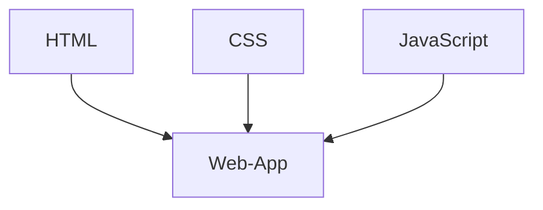

# Theorie: Web-App Basics

## Was ist eine Web-App?

Eine Web-App ist eine Anwendung, die im Browser läuft.  
Sie besteht aus drei Technologien:



| Technologie | Aufgabe | Vergleich |
|-------------|---------|-----------|
| :material-language-html5: HTML | Struktur & Inhalt | Das Skelett eines Hauses |
| :material-language-css3: CSS | Aussehen & Layout | Die Farbe und Möbel |
| :material-language-javascript: JavaScript | Logik & Interaktion | Die Elektrik und Sanitär |

## HTML: Die Grundstruktur

Jede HTML-Seite hat das gleiche Grundgerüst:

```html
<!DOCTYPE html>
<html lang="de">
<head>
    <meta charset="UTF-8">
    <meta name="viewport" content="width=device-width, initial-scale=1.0">
    <title>Meine App</title>
    <link rel="stylesheet" href="style.css">
</head>
<body>
    <h1>Überschrift</h1>
    <p>Ein Absatz mit Text.</p>
    <script src="script.js"></script>
</body>
</html>
```

### Wichtige HTML-Elemente

| Element | Beschreibung | Beispiel |
|---------|-------------|---------|
| `<h1>` – `<h6>` | Überschriften | `<h1>Dashboard</h1>` |
| `<p>` | Absatz | `<p>Hallo Welt</p>` |
| `<div>` | Container/Box | `<div class="card">...</div>` |
| `<span>` | Inline-Text | `<span class="wert">23.4</span>` |
| `<ul>` / `<li>` | Liste | `<ul><li>Raum B101</li></ul>` |

## CSS: Das Aussehen

CSS gestaltet HTML-Elemente:

```css
/* Ein Element auswählen */
h1 {
    color: teal;
    font-size: 24px;
}

/* Eine Klasse auswählen (beginnt mit .) */
.card {
    background: white;
    border-radius: 8px;
    padding: 16px;
    box-shadow: 0 2px 4px rgba(0,0,0,0.1);
}

/* Eine ID auswählen (beginnt mit #) */
#temperatur {
    font-size: 48px;
    font-weight: bold;
}
```

### CSS-Farben

```css
/* Für die Status-Anzeige */
.gut { color: green; }
.kritisch { color: orange; }
.schlecht { color: red; }
```

## JavaScript: Die Logik

JavaScript macht die Seite interaktiv:

```javascript
// Auf ein Element zugreifen
const element = document.getElementById('temperatur');

// Inhalt ändern
element.textContent = '23.4 °C';

// Auf Klick reagieren
element.addEventListener('click', () => {
    alert('Temperatur wurde geklickt!');
});
```

## Die drei Dateien verbinden

`index.html`:
```html
<link rel="stylesheet" href="style.css">
<script src="script.js"></script>
```

!!! tip "Reihenfolge"
    CSS immer im `<head>`, JavaScript immer **vor** `</body>`.  
    So ist das HTML schon geladen, wenn das Script läuft.

## Zusammenfassung

- HTML = Struktur
- CSS = Design
- JavaScript = Verhalten
- Alle drei zusammen = Web-App

## Weiter

Jetzt weisst du, wie eine Web-App aufgebaut ist.  
In der Übung baust du deine erste eigene Karte!
