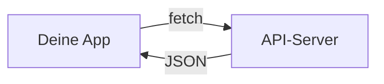

# Theorie: JSON / API / Fetch

## Was ist JSON?

JSON (JavaScript Object Notation) ist ein Format zum Speichern und Austauschen von Daten.  
Es ist für Menschen lesbar und für Maschinen einfach zu verarbeiten.

```json
{
  "room": "B101",
  "temperature": 23.4,
  "humidity": 51,
  "timestamp": "2026-08-06T10:30:00"
}
```

### JSON-Regeln

| Regel | Beispiel |
|-------|----------|
| Geschweifte Klammern `{}` für Objekte | `{ "name": "B101" }` |
| Eckige Klammern `[]` für Listen | `[1, 2, 3]` |
| Schlüssel immer in doppelten Anführungszeichen | `"name"` |
| Werte: String, Number, Boolean, null, Objekt, Array | `"text"`, `42`, `true` |
| Kein Komma nach dem letzten Element | `{ "a": 1, "b": 2 }` :material-check: |

### JSON vs. JavaScript-Objekt

```javascript
// JSON (String)
const jsonString = '{"room": "B101", "temperature": 23.4}';

// In JavaScript-Objekt umwandeln
const data = JSON.parse(jsonString);
console.log(data.room); // "B101"

// Zurück in JSON
const jsonAgain = JSON.stringify(data);
```

## Was ist eine API?

Eine API (Application Programming Interface) ist eine Schnittstelle zwischen Programmen.



Eine REST-API nutzt HTTP-Methoden:

| Methode | Bedeutung |
|---------|-----------|
| `GET` | Daten abrufen |
| `POST` | Neue Daten senden |
| `PUT` | Daten aktualisieren |
| `DELETE` | Daten löschen |

Wir nutzen nur `GET` – Daten abrufen.

## Fetch: Daten laden

`fetch()` ist die eingebaute JavaScript-Funktion, um Daten von einem Server zu laden.

### Grundform (mit Promises)

```javascript
fetch('data.json')
  .then(response => response.json())
  .then(data => {
    console.log(data);
    // Daten anzeigen
  })
  .catch(error => {
    console.error('Fehler:', error);
  });
```

### Moderne Form (mit async/await)

```javascript
async function loadData() {
  try {
    const response = await fetch('data.json');
    const data = await response.json();
    console.log(data);
    // Daten anzeigen
  } catch (error) {
    console.error('Fehler:', error);
  }
}

loadData();
```

??? info "Was ist async/await?"
    `async` markiert eine Funktion als asynchron.  
    `await` wartet, bis ein Promise fertig ist – der Code darunter läuft erst danach.  
    `try/catch` fängt Fehler ab, z. B. wenn die Datei nicht existiert.

## Daten im HTML anzeigen

```javascript
async function loadData() {
  try {
    const response = await fetch('data.json');
    const data = await response.json();

    // HTML-Elemente befüllen
    document.getElementById('room-name').textContent = data.room;
    document.getElementById('temperature').textContent = data.temperature + ' °C';
    document.getElementById('humidity').textContent = data.humidity + ' %';
  } catch (error) {
    document.getElementById('status').textContent = 'Keine Daten verfügbar';
  }
}
```

## Statuslogik

```javascript
function getStatus(temp, humidity) {
  const tempOk = temp >= 20 && temp <= 24;
  const humOk = humidity >= 40 && humidity <= 60;
  const tempWarn = temp >= 18 && temp <= 26;
  const humWarn = humidity >= 30 && humidity <= 70;

  if (tempOk && humOk) return 'gut';
  if (tempWarn || humWarn) return 'kritisch';
  return 'schlecht';
}
```

## Fehlerbehandlung

```javascript
async function loadData() {
  try {
    const response = await fetch('data.json');
    if (!response.ok) {
      throw new Error('Server nicht erreichbar');
    }
    const data = await response.json();
    return data;
  } catch (error) {
    showError('Daten konnten nicht geladen werden');
    return null;
  }
}

function showError(message) {
  const el = document.getElementById('status');
  el.textContent = message;
  el.className = 'status error';
}
```

## Zusammenfassung

- JSON ist ein Datenformat
- `fetch()` lädt Daten von einem Server oder einer Datei
- `async/await` macht asynchronen Code lesbar
- `getStatus()` berechnet den Status aus Werten
- Immer einen Fehlerfall einbauen

## Weiter

Jetzt kennst du die Grundlagen. In der Übung probierst du es aus!