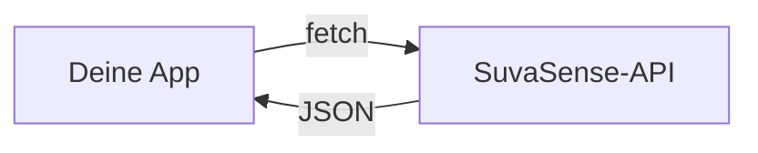

# Theorie: JSON / API / Fetch

## Was ist JSON?

JSON (JavaScript Object Notation) ist ein Format zum Speichern und Austauschen von Daten.  
Es ist für Menschen lesbar und für Maschinen einfach zu verarbeiten.

Im Bootcamp arbeiten wir mit dem **Push-Bundle-Format** des SuvaSense-Backends:

```json
{
  "recorded_at": "2026-08-06T10:30:00Z",
  "readings": {
    "bme680": {
      "temp_c": 23.4,
      "hum_pct": 51
    }
  }
}
```

| Feld | Bedeutung |
|---|---|
| `recorded_at` | Zeitpunkt der Messung (ISO-8601) |
| `readings.bme680.temp_c` | Temperatur in °C |
| `readings.bme680.hum_pct` | Relative Feuchte in % |

Weitere Sensortypen können vorkommen (`veml7700`, `mpu6050`, `system`), sind aber optional.

### JSON-Regeln

| Regel | Beispiel |
|-------|----------|
| Geschweifte Klammern `{}` für Objekte | `{ "name": "SN12345" }` |
| Eckige Klammern `[]` für Listen | `[{...}, {...}]` |
| Schlüssel immer in doppelten Anführungszeichen | `"name"` |
| Werte: String, Number, Boolean, null, Objekt, Array | `"text"`, `42`, `true` |
| Kein Komma nach dem letzten Element | `{ "a": 1, "b": 2 }` :material-check: |

### JSON vs. JavaScript-Objekt

```javascript
// JSON (String)
const jsonString = '{"recorded_at":"2026-08-06T10:30:00Z","readings":{"bme680":{"temp_c":23.4,"hum_pct":51}}}';

// In JavaScript-Objekt umwandeln
const data = JSON.parse(jsonString);
console.log(data.readings.bme680.temp_c); // 23.4

// Zurück in JSON
const jsonAgain = JSON.stringify(data);
```

## Was ist eine API?

Eine API (Application Programming Interface) ist eine Schnittstelle zwischen Programmen.


```mermaid
graph LR
    A[Deine App] -->|fetch| B[SuvaSense-API]
    B -->|JSON| A
```

Eine REST-API nutzt HTTP-Methoden:

| Methode | Bedeutung |
|---------|-----------|
| `GET` | Daten abrufen |
| `POST` | Neue Daten senden |
| `PUT` | Daten aktualisieren |
| `DELETE` | Daten löschen |

Wir nutzen nur `GET` – Daten abrufen.

## Fetch: Daten laden

`fetch()` ist die eingebaute JavaScript-Funktion, um Daten von einem Server zu laden.

### Grundform (mit Promises)

```javascript
fetch('data.json')
  .then(response => response.json())
  .then(data => {
    console.log(data);
    // Daten anzeigen
  })
  .catch(error => {
    console.error('Fehler:', error);
  });
```

### Moderne Form (mit async/await)

```javascript
async function loadData() {
  try {
    const response = await fetch('data.json');
    const data = await response.json();
    console.log(data);
    // Daten anzeigen
  } catch (error) {
    console.error('Fehler:', error);
  }
}

loadData();
```

??? info "Was ist async/await?"
    `async` markiert eine Funktion als asynchron.  
    `await` wartet, bis ein Promise fertig ist – der Code darunter läuft erst danach.  
    `try/catch` fängt Fehler ab, z. B. wenn die Datei nicht existiert.

## Daten im HTML anzeigen

```javascript
async function loadData() {
  try {
    const response = await fetch('data.json');
    const data = await response.json();

    // Push-Bundle ist ein Array; das neueste ist [0]
    const latest = data[0];
    const bme = latest.readings.bme680;

    document.getElementById('recorded-at').textContent = latest.recorded_at;
    document.getElementById('temp-c').textContent       = bme.temp_c + ' °C';
    document.getElementById('hum-pct').textContent      = bme.hum_pct + ' %';
  } catch (error) {
    document.getElementById('status').textContent = 'Keine Daten verfügbar';
  }
}
```

## Statuslogik

Die Logik bleibt dieselbe wie immer – sie bekommt nur neue Eingabewerte:

```javascript
// Werte stammen von EDB (siehe ../projekt/edb.md#schwellenwerte-von-edb-vorgegeben)
// NICHT selbst waehlen!
const EDB_TEMP_GUT_MIN     = 20;
const EDB_TEMP_GUT_MAX     = 24;
const EDB_TEMP_KRITISCH_MIN = 18;
const EDB_TEMP_KRITISCH_MAX = 26;
const EDB_HUM_GUT_MIN       = 40;
const EDB_HUM_GUT_MAX       = 60;
const EDB_HUM_KRITISCH_MIN  = 30;
const EDB_HUM_KRITISCH_MAX  = 70;

function getStatus(tempC, humPct) {
  const tempOk   = tempC >= EDB_TEMP_GUT_MIN     && tempC <= EDB_TEMP_GUT_MAX;
  const humOk    = humPct  >= EDB_HUM_GUT_MIN    && humPct  <= EDB_HUM_GUT_MAX;
  const tempWarn = tempC >= EDB_TEMP_KRITISCH_MIN && tempC <= EDB_TEMP_KRITISCH_MAX;
  const humWarn  = humPct  >= EDB_HUM_KRITISCH_MIN && humPct <= EDB_HUM_KRITISCH_MAX;

  if (tempOk && humOk) return 'gut';
  if (tempWarn || humWarn) return 'kritisch';
  return 'schlecht';
}
```

!!! important "Werte kommen von EDB"
    Die Konstanten oben (`EDB_TEMP_GUT_MIN` etc.) sind **fix von EDB
    vorgegeben**. Du übernimmst sie aus der
    [EDB-Schwellenwerte-Tabelle](../projekt/edb.md#schwellenwerte-von-edb-vorgegeben)
    in deinen Code. **Wähle sie nicht selbst** – sonst ist deine App
    nicht EDB-konform.

Die App ruft die Funktion mit den **BME680-Werten** auf:

```javascript
const status = getStatus(bme.temp_c, bme.hum_pct);
```

## Fehlerbehandlung

```javascript
async function loadData() {
  try {
    const response = await fetch('data.json');
    if (!response.ok) {
      throw new Error('Server nicht erreichbar');
    }
    const data = await response.json();
    return data;
  } catch (error) {
    showError('Daten konnten nicht geladen werden');
    return null;
  }
}

function showError(message) {
  const el = document.getElementById('status');
  el.textContent = message;
  el.className = 'status error';
}
```

## Zusammenfassung

- JSON ist ein Datenformat
- `fetch()` lädt Daten von einem Server oder einer Datei
- `async/await` macht asynchronen Code lesbar
- `getStatus()` berechnet den Status aus `temp_c` und `hum_pct`
- Immer einen Fehlerfall einbauen

## Weiter

Jetzt kennst du die Grundlagen. In der Übung probierst du es aus!