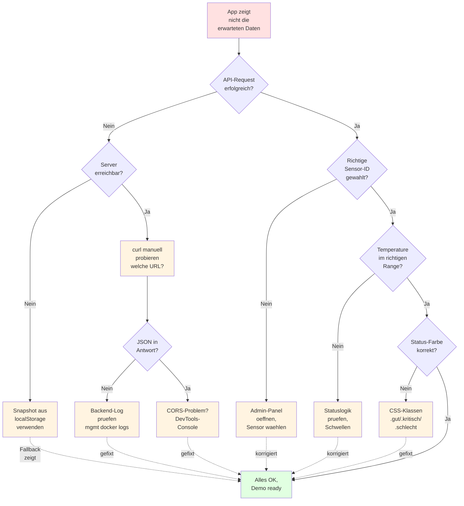

# Testen & Bugs fixen

## :material-target: Ziel

Finde und behebe alle Fehler in deiner App, bevor du die Demo zeigst.

## Diagnose-Baum: was tun, wenn X nicht funktioniert?

**Wie du den Baum benutzt:**

1. Fang oben an mit "App zeigt nicht die erwarteten Daten"
2. Folge den Fragen (`{ja/nein}`-Diamanten) basierend auf dem,
   was du beobachtest
3. Jeder Endpunkt (`A1`–`A7`) ist eine konkrete Aktion
4. Wenn der Fix klappt, kommst du zurück zum grünen "Demo ready"

**Was NICHT im Baum steht:**

- Performance-Probleme (eigene Kategorie)
- Browser-Kompatibilität (jeder Browser ist heute OK für Basics)
- Mobile-Ansicht (separater Test, nicht kritisch)

## Systematisch testen

Geh jeden Bereich deiner App durch:

### 1. Start-Test

- [ ] Seite laden → alles da?
- [ ] Keine Fehler in der Browser-Konsole (F12)?
- [ ] CSS geladen? (keine kaputten Styles)

### 2. Daten-Test

- [ ] Richtige `temp_c` und `hum_pct` werden angezeigt?
- [ ] Status passt zu den Werten?
- [ ] Verlaufsliste zeigt mehrere Push-Bundles?
- [ ] Snapshot ist im LocalStorage gespeichert (DevTools → Application)?

### 3. Status-Test

Setze in `data.json` verschiedene BME680-Werte und prüfe:

| `temp_c` | `hum_pct` | Soll-Status |
|---|---|---|
| 22.0 | 50 | Gut |
| 23.0 | 41 | Gut |
| 25.5 | 45 | Kritisch |
| 18.5 | 60 | Kritisch |
| 30.0 | 20 | Schlecht |
| 15.0 | 80 | Schlecht |

### 4. Snapshot-Fallback-Test

- [ ] App frisch laden (Cache leeren) → Seed aus `data.json` greift
- [ ] WLAN trennen → App zeigt weiterhin Werte (aus `localStorage`)
- [ ] WLAN wieder verbinden → App holt neue Daten
- [ ] `localStorage.clear()` + `data.json` umbenennen → Fehlermeldung erscheint

### 5. Admin-Test

- [ ] Sensor wechseln → Daten ändern sich?
- [ ] Grenzwerte ändern → Status reagiert?

### 6. Responsive-Test

- [ ] Fenster auf Handy-Breite verkleinern → Layout passt sich an?
- [ ] Keine Elemente abgeschnitten?
- [ ] Schrift noch lesbar?

## Konsole prüfen

Öffne die Entwickler-Tools (F12) und schau auf den «Console»-Tab.  
Alles, was **rot** ist, ist ein Fehler. Alles, was **gelb** ist, ist eine Warnung.

## Bug-Tracking

| Bug | Schwere | Status | Wer? |
|-----|---------|--------|------|
| | :material-alert: Hoch :material-close: Mittel :material-information: Niedrig | Offen | |
| | | | |

## Häufige Bugs

??? bug "fetch() funktioniert nicht"
    **Ursache**: Live Server läuft nicht, oder Pfad falsch.  
    **Lösung**: Live Server starten, Pfad prüfen (relativ zur HTML-Datei).

??? bug "Status bleibt immer gleich"
    **Ursache**: `getStatus()` wird mit falschen oder keinen Werten aufgerufen.  
    **Lösung**: `console.log(tempC, humPct)` in `getStatus()` einbauen.

??? bug "element.textContent is null"
    **Ursache**: HTML-Element mit der ID existiert nicht.  
    **Lösung**: IDs in HTML und JavaScript abgleichen.

??? bug "Snapshot zeigt alte Werte"
    **Ursache**: API liefert nicht, App greift auf alten Snapshot zurück.  
    **Lösung**: `localStorage.removeItem('snapshot:SN12345')` in der Konsole, dann Reload.

??? bug "Push-Bundle enthält kein BME680"
    **Ursache**: PE-Team publiziert nur `veml7700` und `system`, kein `bme680`.  
    **Lösung**: Mit Trainer klären; App sollte das mit `if (!bme) return` abfangen.

## Checkliste Testen

- [ ] Alle 6 Testbereiche geprüft
- [ ] Status-Test mit 6 verschiedenen Wertepaaren
- [ ] Snapshot-Fallback einmal mit und ohne API getestet
- [ ] Browser-Konsole ist sauber (keine roten Fehler)
- [ ] Gefundene Bugs sind behoben oder dokumentiert

!!! success "Bugfrei?"
    Super! Dann weiter zu den [optionalen Features](optionale-features.md).